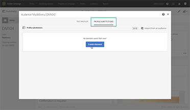
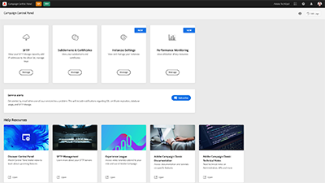
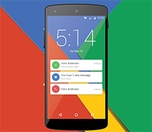

# Tutoriais do Adobe Campaign Standard

O Adobe Campaign fornece uma plataforma para criação de experiências para clientes entre canais, além de um ambiente para a orquestração visual de campanhas, a gestão de interações em tempo real e a execução entre canais. Este guia do usuário contém vídeos e tutoriais sobre os vários recursos e funcionalidades do Adobe Campaign Standard.

## Seleção de pessoal

<table>
<tr>
  <td>
    
    

      <a href="./communication-channels/email/profile-substitution.md">
    <strong>Substituição de perfil – Teste de mensagens de email usando perfis direcionados (vídeo)</strong>
    </a>
    

    

    <em>Aprenda a enviar uma prova para análise com a representação exata da mensagem que o perfil recebe.</em>
    

  </td>
   <td>
    
    

    <a href="https://experienceleague.adobe.com/docs/control-panel-learn/tutorials/control-panel-overview.html?lang=pt-BR">
    <strong>Painel de controle (vídeos)</strong>
    </a>
    

    

    <em> Aumente sua eficiência como administrador gerenciando configurações e rastreando o uso de suas instâncias com o Painel de controle .</em>
    

  </td>
  <td>
    
    

      <a href="https://experienceleague.adobe.com/docs/campaign-standard-learn/getting-started-with-push-notifications-android/introduction.html?lang=pt-BR">
    <strong>Tutorial: Introdução a notificações por push para Android™</strong>
    </a>
    

    

    <em>Este tutorial percorre as etapas envolvidas no envio de notificações por push do Adobe Campaign e no recebimento dessas notificações em aplicativos Android™. </em>
    

  </td>
</tr>
</table>

