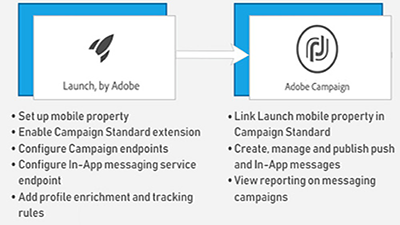

# Visão geral

O Adobe Campaign fornece uma plataforma para projetar experiências de clientes entre canais, além de um ambiente para a organização visual de campanhas, a gestão de interações em tempo real e a execução entre canais. Este guia do usuário contém vídeos e tutoriais sobre os vários recursos e capacidades do Adobe Campaign Standard.

## Novidades

* **[Atividade de API externa](/help/managing-processes-and-data/data-management-activities/external-api-activity.md)**    
   *Saiba como configurar e executar um fluxo de trabalho com a atividade de API externa.*

* **[Substituição de Perfil - Testando mensagens de email usando perfis direcionados](/help/communication-channels/email/profile-substitution.md)**    
   *Saiba como enviar uma prova para revisão com a representação exata da mensagem que o perfil receberá.*

* **[Painel de controle - Gerenciamento de registros do Google TXT](/help/administrating/control-panel/google-txt-record-management.md)**    
   *Saiba como adicionar o registro de verificação de site do Google TXT a todos os seus subdomínios usados para enviar emails para endereços GMAIL por meio do Painel de controle de Campanha.*

* **[Tutorial: Introdução às notificações por push para Android](https://docs.adobe.com/content/help/en/campaign-standard-learn/getting-started-with-push-notifications-android/introduction.html)**    
   *Este tutorial o orienta pelas etapas envolvidas no envio de notificações por push do Adobe Campaign e no recebimento dessas notificações no aplicativo Android.*

## Separações de Pessoal

<table>
<tr>
  <td>
    
    

      <a href="./communication-channels/mobile/in-app/in-app-message-overview.md">
    <strong>Mensagens no aplicativo (tutorial)</strong>
    </a>
    

    

    <em>As mensagens no aplicativo são um canal que permite exibir uma mensagem quando o usuário está ativo em um aplicativo móvel.</em>
    

  </td>
   <td>
    
    

      <a href="./designing-content/email-designer/email-designer-overview.md">
    <strong>Designer de email (vídeos)</strong>
    </a>
    

    

    <em>O Designer de e-mail permite a criação visual rápida e sem esforços de e-mails personalizados individualmente.</em>
    

  </td>
  <td>
    
    

      <a href="./designing-content/product-listings-in-transactional-email.md">
    <strong>Listas de produtos (tutorial)</strong>
    </a>
    

    

    <em>Crie emails transacionais com uma lista de produtos e ofertas. </em>
    

  </td>
</tr>
</table>

## Recursos adicionais

* [Documentação](https://docs.adobe.com/content/help/pt-BR/campaign-standard/using/campaign-standard-home.html)
